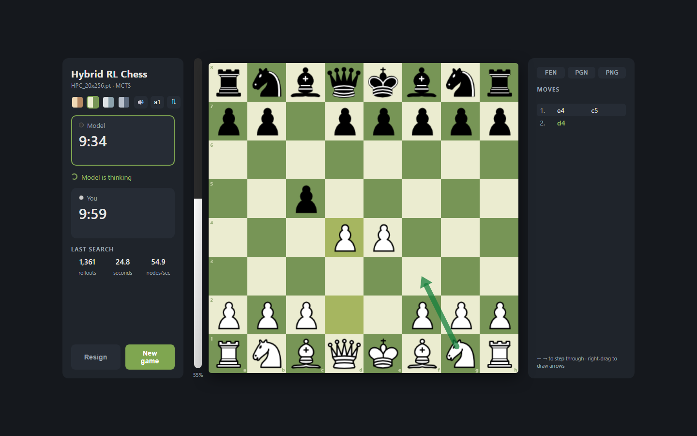

# ♟️ Chess AI Development Using Reinforcement Learning

[](https://huggingface.co/spaces/niishantx/hybrid-rl-chess)
[](https://www.python.org/)
[](https://pytorch.org/)
[](https://github.com/niklasf/python-chess)
[](LICENSE)

> ### ♟️ [**Play against the model right now — live on Hugging Face**](https://huggingface.co/spaces/niishantx/hybrid-rl-chess)
> No install needed. One game runs at a time.
>
> ⚠️ **Note:** the free hosting runs on a small CPU, so the live demo searches far fewer positions per move than the model is capable of. For the model at **full capacity** — ~15× deeper search on a GPU, plus the untimed ∞ full-power mode — install and run it locally (below). If you have an NVIDIA GPU, it is used automatically.

**A hybrid chess engine that learned from experts, then taught itself.** Supervised pre-training on millions of engine games + AlphaZero-style MCTS self-play refinement — strong play at a fraction of AlphaZero's compute. Built for my MSc Data Analytics dissertation at the University of Sheffield ([read the full dissertation](Dissertation.pdf)) and playable in your browser.



## ✨ Highlights

- 🏆 **Beat Komodo 24 (Elo 2900) and Stockfish level 7** — drew with Komodo 25 (3200) and Stockfish 8 (3000)
- 🧠 **AlphaZero-style network**: 20 residual blocks × 256 filters, dual value + policy heads, parallel MCTS with virtual loss
- ⚡ **~30% less compute** than a pure self-play pipeline, thanks to expert-guided pre-training
- ⏱️ **Human-like time management**: in the web app, the model budgets its thinking from a real chess clock
- 📖 **Self-distilled opening book**: the model's own deep GPU searches (~6,000 rollouts each) cached ahead of time, so the CPU-hosted live demo plays the opening phase instantly at full strength
- 🌐 **Live on Hugging Face**: multi-session server, Docker image, one-game-at-a-time hosting mode

## 🎮 Play against the model

```bash
git clone https://github.com/Nishantsgithub/Chess-AI-Development-Using-Reinforcement-Learning.git
cd Chess-AI-Development-Using-Reinforcement-Learning
pip install -r requirements.txt
python app/server.py
```

Your browser opens automatically. Pick **5 / 10 / 30 minutes** or a custom clock — the model paces its search to the time control, so longer games mean deeper, stronger play. Or choose **∞ full power**: no clocks, maximum think time every move.

| | |
|---|---|
| 🕐 Real chess clocks | the model can flag, and so can you |
| ⚡ Premove | queue your reply while the model thinks |
| 🎨 4 board themes | classic, green, ice, slate |
| 📈 Live eval bar | straight from the network's value head |
| 🏹 Analysis arrows | right-drag to draw, right-click to highlight |
| ⏪ Move review | step through the game with ← → |
| 🔊 Sounds | move / capture / castle / check / promotion / low time |
| 📦 Export | PGN download, FEN copy, board PNG snapshot |
| 🔍 Search stats | rollouts, nodes/sec, and reused tree per move |

Have an NVIDIA GPU? Install a CUDA build of PyTorch and the engine uses it automatically (~3× the search speed). The engine also **reuses its search tree** between moves — up to half of each search comes free.

### 🚀 Deployment

Ships with a [Dockerfile](Dockerfile) (port 7860, Hugging Face Spaces convention). Set `DEPLOYED=1` for hosting mode: CPU-tuned budgets, rate limiting, and **one game at a time** — whoever is playing gets the model's full strength while other visitors wait in an auto-starting queue.

## 🔬 The research journey

The dissertation advanced through four stages, each answering a question the previous one raised:

**Stage 1 — Can RL solve chess at all? (4×4 endgame, K+Q vs K)**
DQN vs DDQN on the classic "checkmate with a queen" problem. DDQN converged to optimal checkmating play in ~30,000 steps (γ = 0.95, β = 10). A myopic discount factor (γ = 0.05) stalled at reward 0.8 forever — **chess punishes short-term thinking**, in training as on the board.

**Stage 2 — Does it scale to the full game?**
DDQN vs classical MCTS on 8×8 over 100 games against a random opponent:

| Model | Wins | Losses | Draws |
|---|---|---|---|
| DDQN | 2 | 2 | 96 |
| **MCTS** | **28** | **9** | **63** |

Value-based RL alone drowned in chess's state space; **tree search was the way forward**.

**Stage 3 — Full AlphaZero?**
The self-play loop worked — iteration 2 beat iteration 1 with 8 wins to 4 (88 draws), winning promotion at the >55% threshold — but at ~2 hours per 100 games, dissertation-scale compute couldn't feed it. DeepMind trained on 44 *million* games.

**Stage 4 — The Hybrid** 💡
Pre-train on the CCRL expert dataset (~2.5M top engine games), then refine with epsilon-greedy MCTS self-play (exploration decaying as the game progresses). Games were quality-checked against Stockfish to tune the exploration schedule. The result:

| Opponent (Elo) | As White | As Black |
|---|---|---|
| Komodo 25 (3200) | ½ Draw | ½ Draw |
| Komodo 24 (2900) | ✅ **Win** | ½ Draw |
| Komodo 23 (2700) | ✅ **Win** | ✅ **Win** |
| Stockfish 8 (3000) | ½ Draw | ½ Draw |
| Stockfish 7 (2700) | ✅ **Win** | ½ Draw |
| Stockfish 6 (2500) | ✅ **Win** | ✅ **Win** |

And the wildest finding: a hybrid bootstrapped from *human* games (~2500 Elo data) and refined by self-play went **11–9 against the CCRL-trained baseline** built on ~2900–3000 Elo data — the self-play mechanism itself creates real strength, not just the data quality.

## ⚙️ How the engine works

- **Input**: the board as a 16-plane 8×8 tensor (piece positions, turn, castling rights)
- **Network**: conv stem → 20 residual blocks (256 filters) → value head (tanh, "who's winning?") + policy head (4608 logits, "what's promising?")
- **Search**: MCTS guided by the policy prior using UCT selection; parallel rollouts use **virtual loss** so threads explore different lines; the value head replaces random playouts
- **Anti-repetition**: when clearly winning, the engine avoids drifting into threefold-repetition draws — a fix promised in the dissertation's future-work list, delivered in the app
- **Time management** (app): think-budget ≈ remaining clock / 24 + increment, with tree reuse carrying past work forward
- **Opening book** ([`tools/build_book.py`](tools/build_book.py)): the opening tree is pre-searched offline on GPU — 20s per position, branching over the opponent's most likely replies (per the model's own policy prior). Online, book positions are answered instantly from the cache; the search only spends CPU where the game is genuinely new. Pure computational efficiency: same model, same moves, none of the cost

## 🏋️ Training pipeline (Hybrid)

```
CCRL expert games ──► supervised pre-training ──► base model
        ▲                                            │
        │                                            ▼
   fix_pgn_results.py ◄── selfplay.py (ε-greedy MCTS self-play)
        │                                            
        ▼                                            
  train_self.py (fine-tune) ──► evaluate vs previous best ──► promote if ≥55% ↺
```

Scripts live in [`training/`](training/) — every step takes standard CLI arguments (see each file's docstring).

## 🗂️ Repository structure

```
AlphaZeroNetwork.py    # the network: 20 residual blocks, value + policy heads
MCTS.py                # parallel MCTS with UCT selection and virtual loss
encoder.py             # board -> 16-plane tensor; move <-> policy-index mapping
playchess.py           # original CLI: play or watch self-play
app/                   # web app: FastAPI server, clock-aware engine, UI
tools/                 # opening-book distillation, ONNX export
training/              # hybrid loop: self-play generation + fine-tuning
experiments/dqn/       # stage-1 endgame DQN/DDQN experiments (Tianshou)
GUI/                   # legacy pygame desktop GUI
weights/               # six trained models (~97 MB each)
Dissertation.pdf       # the full write-up (63 pages)
```

### 🧬 Model zoo

All the same 20×256 architecture — swap any into the app with `--model`:

| Weights | What it is |
|---|---|
| `HPC_20x256.pt` | 🥇 **The hybrid, trained on Sheffield's HPC — strongest, app default** |
| `AlphaZeroNet_20x256.pt` | CCRL supervised baseline |
| `selfplay_iteration1_20x256_epoch29.pt` | Hybrid self-play, iteration 1 |
| `AlphaZero_Iteration2_20x256.pt` | Self-play iteration 2 ("Model 2") |
| `human_20x256.pt` | Supervised on ~2500-Elo human games |
| `FineTuned_human_20x256_epoch2.pt` | The human-data hybrid that beat the CCRL baseline |

## 📚 Research foundations

The ideas this project stands on — the reading list behind the dissertation:

| Work | Why it matters here |
|---|---|
| [Sutton & Barto — *Reinforcement Learning: An Introduction*](http://incompleteideas.net/book/the-book.html) | The foundations: MDPs, Bellman equations, exploration vs exploitation |
| [Silver et al. — *Mastering Chess and Shogi by Self-Play* (AlphaZero)](https://arxiv.org/abs/1712.01815) | The blueprint this project adapts to a realistic compute budget |
| [Mnih et al. — *Playing Atari with Deep RL*](https://arxiv.org/abs/1312.5602) / [*Human-level control*](https://www.nature.com/articles/nature14236) | DQN — experience replay and target networks (stage 1 & 2) |
| [van Hasselt et al. — *Deep RL with Double Q-learning*](https://arxiv.org/abs/1509.06461) | DDQN — fixing Q-value overestimation (stage 1 & 2) |
| [Browne et al. — *A Survey of MCTS Methods*](https://ieeexplore.ieee.org/document/6145622) | The search algorithm at the heart of the engine |
| [Kocsis & Szepesvári — *Bandit based Monte-Carlo Planning*](https://link.springer.com/chapter/10.1007/11871842_29) | UCT — the selection formula MCTS runs on |
| [Silver et al. — *Mastering the game of Go* (AlphaGo)](https://www.nature.com/articles/nature16961) / [*without human knowledge* (AlphaGo Zero)](https://www.nature.com/articles/nature24270) | Policy+value networks married to tree search |
| [Lai — *Giraffe: Using Deep RL to Play Chess*](https://arxiv.org/abs/1509.01549) | Proof that a neural net could learn chess evaluation end-to-end |

## 🙏 Acknowledgements

- Core network/MCTS/encoder implementation builds on [jackdawkins11/pytorch-alpha-zero](https://github.com/jackdawkins11/pytorch-alpha-zero), substantially extended for this research (hybrid training, epsilon-greedy self-play, repetition avoidance, the web app, GPU support, search-tree reuse)
- [python-chess](https://github.com/niklasf/python-chess) for rules and PGN handling · [Tianshou](https://github.com/thu-ml/tianshou) for the DQN experiments
- Supervised by **Prof. Eleni Vasilaki**, Department of Computer Science, University of Sheffield

## 📄 License

[MIT](LICENSE)
